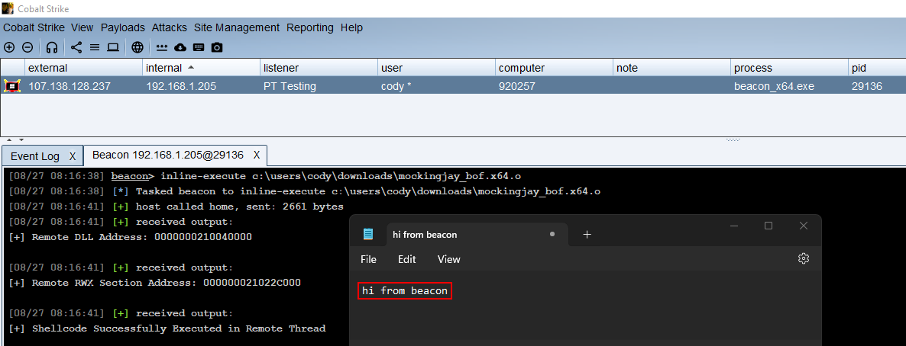
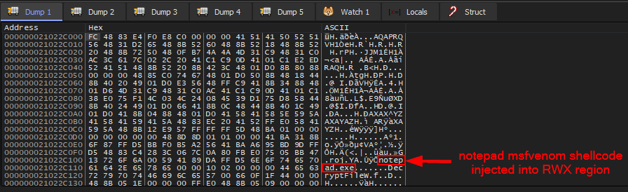

# WIP Mockingjay BOF Conversion (lets be real it's just module stomping)

Learning how to write Cobalt Strike Beacon Object Files, converting my [Mockingjay](https://www.securityjoes.com/post/process-mockingjay-echoing-rwx-in-userland-to-achieve-code-execution) [POC](https://github.com/ewby/Mockingjay_POC) to BOF starting with WINAPI usage and incrementally adding layers of evasion for in-depth testing. Now you don't need a standalone program to perform the technique, it can all be done from your Cobalt Strike beacon.

As of now it's very much a POC, the operator needs to manually enter details they've found of their target (module, section offset, and process ID). I plan to implement quality of life features to make the tool easier to use.

The idea is to find a loaded module in a remote process with a naturally allocated RWX region (and the region be big enough to store your shellcode), calculate the offset to the RWX region and write your shellcode to it without calling the traditional API chain heavily signatured to process injection. This will allow you to exist in a (ideally) signed module loaded into a (ideally) trusted process.

Credits to Namazso (Original Unknown Cheats forum post), Security Joes (Recent infosec article), and Kyle Avery (POC that was recently brought to my attention, helped me improve my original POC).

### BOF Execution

### x64dbg Memory Dump

## TO-DO
* Create a companion Aggressor Script
* Make threadless like what is supposedly possible in the [Security Joes](https://www.securityjoes.com/post/process-mockingjay-echoing-rwx-in-userland-to-achieve-code-execution) article.
* Accept operator arguments rather than manual input? [I have code that will identify memory region characteristics](https://github.com/ewby/Mockingjay_POC/blob/main/mockingjay_self_inject/mockingjay_self_inject/mockingjay_self_inject_winapi.c), maybe the operator could just enter processId, moduleName, path_to_shellcode